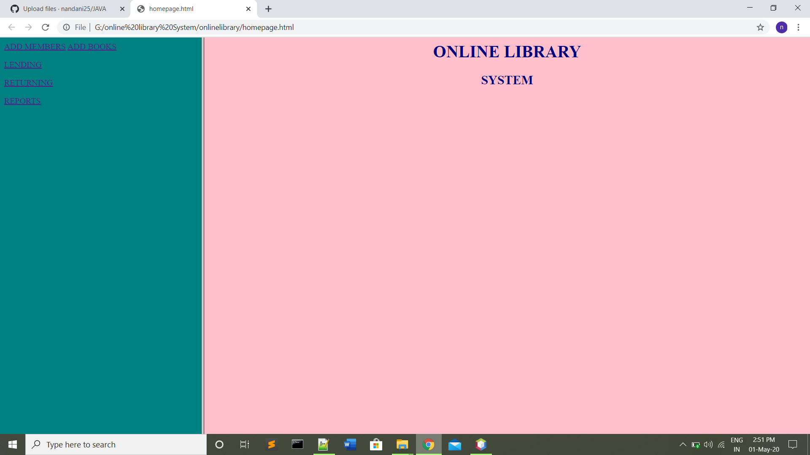
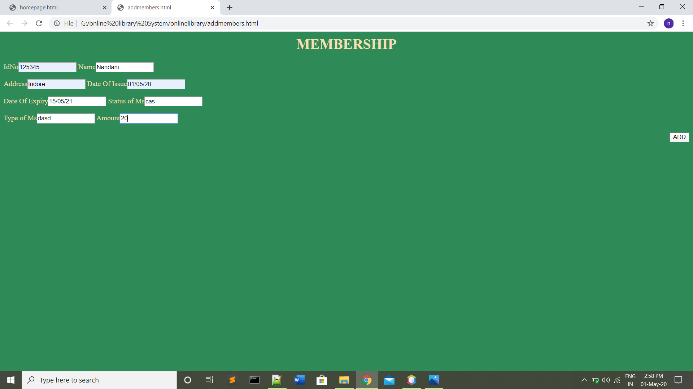
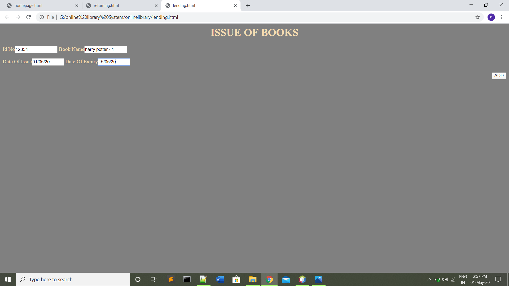
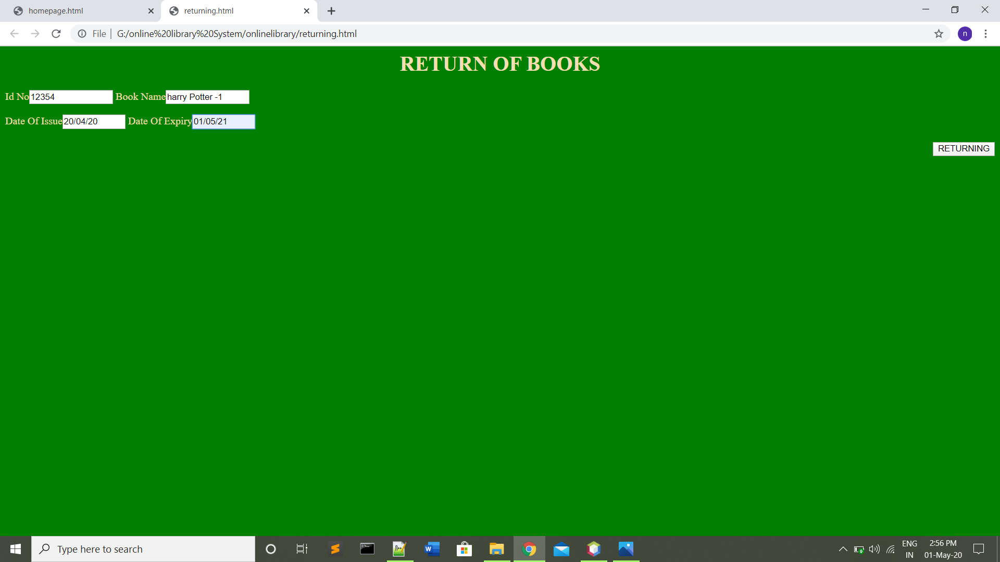
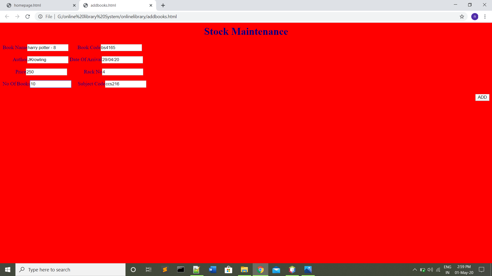
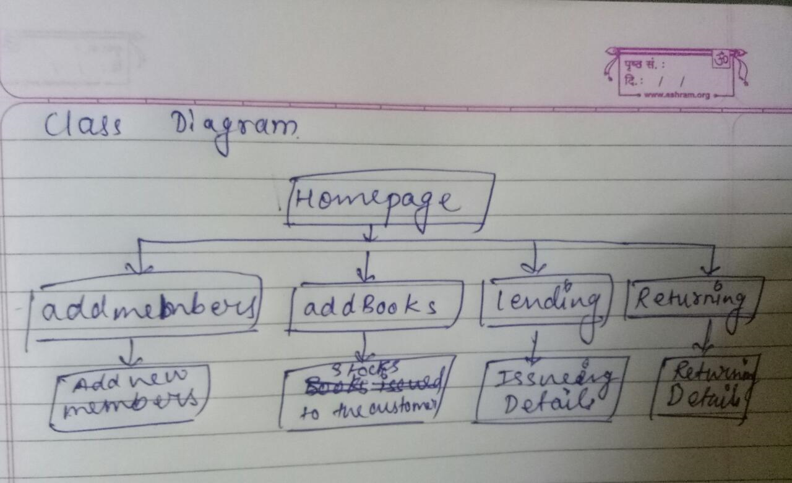
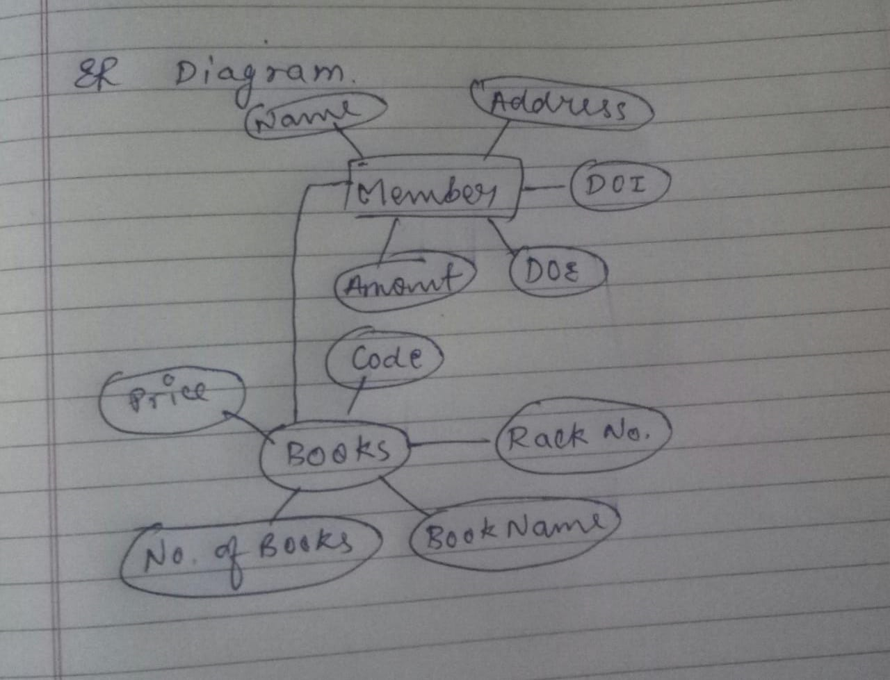

# onlinelibrary
<b><u>Objective</b></u> 
A software which is use to maintain the record of books. Here, Admin can view Customer names, Customer Mobile no., Customer Address and store the data into database.
<b>Users of system</b> 
<ul><li>Admin</li></ul>
<b>Functional Requirements</b> 
<ul>
<li>Admin</li>
1.	Can login and logout.  
2.	Can add Customer details.  
3.	Can view Customer names.  
4.	Can delete Customer names.  
5.	Can update Customer details.  
</ul>
<b>Tools Used</b> 
1.	Java 
2.	Os: Windows 10 
5.  Database Connectivity:-JDBC 
   
<b>Working of Project with Screenshots</b> 
First page:-  
 
This is the home page of the application, clicking the buttons will open a new frame and current frame will be disposed.  
 
Then the next page is for adding members details.
Name, mobile no. and Address etc then click add button. 
 
 
next page is adding books.
details about issuing book to the customer. 
 
next page is returning books.
details about return book. 
 
 MAintaince about books.
 no. of books
 amount of books. 

<b>Class Diagram</b> 
 

<b>ER Diagram</b> 
 
